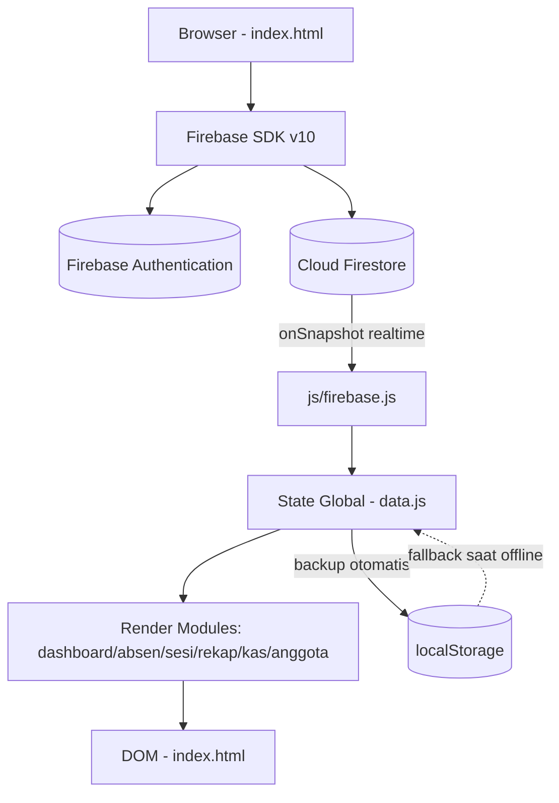

<div align="center">


# Database Muda-Mudi Margosari

Aplikasi internal untuk absensi, kas, dan data anggota — dokumentasi pribadi repo ini.

</div>

> Catatan: repo ini privat, README ini ditulis untuk keperluan dokumentasi pribadi (biar aku sendiri nggak lupa alur & struktur proyeknya kalau buka lagi beberapa bulan ke depan).

---

## 📖 Ringkasan Proyek

Web app single-page untuk mengelola tiga hal operasional kelompok Muda-Mudi Margosari: **absensi kegiatan**, **kas/keuangan**, dan **data anggota**. Dibangun full vanilla HTML/CSS/JavaScript (tanpa framework, tanpa build step), dengan **Firebase** (Authentication + Firestore) sebagai backend & database, sinkron realtime ke semua perangkat yang login.

Semua logic — render halaman, kalkulasi rekap, export laporan — jalan di sisi browser. Tidak ada server sendiri yang ditulis.

---

## ✅ Fitur yang Sudah Ada

| Fitur | Keterangan |
|---|---|
| 🏠 Dashboard | Ringkasan jumlah anggota, sesi terakhir, saldo kas |
| ✅ Absensi | Buat sesi per tanggal, isi status Hadir/Izin/Alfa, mode pilih-banyak (bulk) |
| 🗂️ Sesi | Riwayat semua sesi yang pernah dibuat, bisa dibuka ulang/dihapus |
| 📊 Rekap & Grafik | Statistik bulanan, donut chart, grafik batang tren kehadiran per pertemuan |
| 💰 Kas | Catat pemasukan/pengeluaran, saldo berjalan otomatis |
| 👥 Data Anggota | CRUD anggota (khusus Admin), detail riwayat kehadiran per orang |
| 📤 Export | Excel (.xlsx), CSV, dan Print/PDF — termasuk grafik ikut kecetak |
| 🔐 Login & Role | Firebase Authentication, menu tertentu (Data Anggota) hanya untuk Admin |
| 🔁 Realtime Sync | Perubahan data langsung kelihatan di semua device yang login (Firestore listener) |
| 📴 Cache Offline | Firestore persistent cache + fallback ke `localStorage` kalau koneksi awal gagal |
| 📱 Responsive | Layout beda total antara PC (sidebar+tabel) dan mobile (bottom-nav+kartu) |
| 🔔 Popup Custom | Semua konfirmasi/alert pakai popup sendiri (`appConfirm`/`appAlert`/`appPrompt`), bukan `alert()`/`confirm()` bawaan browser |

<details>
<summary>Detail tambahan per fitur</summary>

- **Absensi bulk**: centang beberapa anggota, set status sekaligus. Update DOM cuma pada item yang dicentang (bukan render ulang seluruh list), jadi nggak ada flicker.
- **Rekap grafik**: dibangun pakai SVG murni (nggak pakai library chart eksternal), sumbu jumlah dibulatkan ke kelipatan 5, sumbu tanggal kegiatan. Ukuran fiks (nggak diregangkan ke lebar layar), keterangan sumbu + warna digabung jadi satu baris di bawah grafik.
- **Data Anggota**: klik nama → modal detail muncul di atas (z-index sudah dibenerin biar nggak ketutup popup lain), isinya rekap semua sesi dia + filter/sort. Ubah nama otomatis migrasi seluruh histori absensi ke nama baru.
- **Export Print**: rekap + grafik + tabel + izin sheet digabung jadi satu halaman print/PDF yang rapi.

</details>

---

## 🖼️ Preview

*(belum ada screenshot — tambahkan di sini kalau sempat)*

```
[ Desktop screenshot ]      [ Mobile screenshot ]
```

---

## 🧱 Tech Stack

| Layer | Teknologi |
|---|---|
| Markup/Style | HTML5, CSS3 (custom properties, tanpa preprocessor) |
| Logic | JavaScript vanilla (ES5/ES6), tanpa framework |
| Auth & DB | Firebase Authentication + Firestore (`v10.12.0`, modular SDK via CDN) |
| Export Excel | SheetJS (`xlsx@0.18.5`, CDN) |
| Export PDF | jsPDF (`v2.5.1`, CDN) |
| Kompresi | JSZip (`v3.10.1`, CDN) — dipakai mendukung fitur export |
| Cache lokal | Firestore persistent cache + `localStorage` fallback |

Tidak ada `package.json`. Semua dependency di-load lewat `<script>` CDN di `index.html`.

---

## 🗂️ Struktur Folder

```
website_absensi/
├── index.html          # Entry point — init Firebase, shell PC & Mobile, semua modal
├── logo.jpg             # Logo aplikasi
├── css/
│   ├── base.css          # Design tokens (warna, radius, shadow) & reset dasar
│   ├── layout.css         # Shell layout, sidebar, bottom-nav, responsive
│   ├── components.css      # Komponen UI reusable (tombol, badge, popup, modal)
│   └── modules.css          # Style spesifik per halaman (kas, rekap, grafik, dll)
└── js/
    ├── boot.js               # Bootstrap app, cek sesi login tersimpan
    ├── auth.js                # Login/logout via Firebase Auth
    ├── firebase.js             # Wrapper baca/tulis Firestore + realtime listener
    ├── data.js                  # State global & seed data + backup/restore localStorage
    ├── helpers.js                 # Utilitas umum: format, popup app custom, show/hide modal
    ├── nav.js                      # Navigasi antar halaman (PC & Mobile)
    ├── dashboard.js                 # Render Dashboard
    ├── absen.js                      # Logic halaman Absensi
    ├── sesi.js                        # Logic halaman Sesi
    ├── rekap.js                        # Rekap bulanan, grafik SVG, export
    ├── kas.js                           # Logic halaman Kas & export
    └── anggota.js                        # CRUD Anggota, detail riwayat, export
```

---

## 🚀 Cara Menjalankan

Tidak ada proses build — cukup file statis.

```bash
git clone <url-repo-ini>
cd website_absensi
```

Jalankan langsung dengan buka `index.html` di browser, atau pakai static server lokal:

```bash
npx serve .
```

---

## ⚙️ Konfigurasi Penting

| Item | Lokasi | Catatan |
|---|---|---|
| Firebase config | `index.html` (bagian `<script type="module">` paling atas) | `apiKey`, `projectId`, dst ditulis langsung — bukan `.env`, karena ini Web SDK client-side |
| Mapping akun login | `js/auth.js` → `USERNAME_MAP` | Setiap akun baru di Firebase Auth harus ditambahin pemetaan `username → email` di sini |
| Firestore collections | dipakai di `js/firebase.js` | `sesi`, `anggota` (doc `list`), `kas`, `log` |
| Firestore Security Rules | di Firebase Console, bukan di repo | **Wajib dicek** — jangan pakai rules default `allow read, write: if true` kalau sudah dipakai beneran |
| Hosting | belum ada file config (`firebase.json` dll) | Bisa disajikan dari static hosting mana pun |

---

## 🏗️ Arsitektur Singkat



---

## 🗺️ Roadmap

- [x] Dashboard ringkasan
- [x] Absensi + mode bulk tanpa re-render penuh
- [x] Rekap bulanan + donut chart + grafik batang
- [x] Export Excel / CSV / Print-PDF
- [x] Login & role Admin
- [x] Detail riwayat per anggota + migrasi nama otomatis
- [x] Realtime sync via Firestore listener
- [x] Popup custom (ganti alert/confirm/prompt bawaan browser)
- [ ] Dark mode
- [ ] PWA (manifest + service worker, biar bisa di-install & offline penuh)
- [ ] Notifikasi/reminder sesi yang belum diisi
- [ ] Absen via QR code / self check-in
- [ ] Kategori transaksi kas (buat breakdown laporan)
- [ ] Badge pencapaian kehadiran anggota

---

## 📝 Catatan Pengembangan

- Semua tanggal sesi disimpan sebagai `key` string (format tanggal), dan bisa dapat suffix `_2`, `_3`, dst kalau ada lebih dari satu sesi di hari yang sama.
- Perubahan status absensi & CRUD anggota selalu lewat fungsi `fbSave*`/`fbDel*` di `firebase.js` — jangan ubah state global langsung tanpa manggil fungsi itu, nanti nggak kesimpan ke Firestore.
- Ganti nama anggota **wajib** lewat `editNamaAnggota()` di `anggota.js`, karena fungsi ini yang migrasiin histori absensi dari nama lama ke nama baru. Kalau edit manual di Firestore, histori lama bakal keputus.
- Popup konfirmasi/alert/isian baru **selalu** pakai `appConfirm()` / `appAlert()` / `appPrompt()` dari `helpers.js` — jangan pakai `confirm()`/`alert()`/`prompt()` browser lagi (sudah pernah jadi bug, popup native ketutup di belakang modal lain).
- Grafik di Rekap itu SVG manual (fungsi `buildBarSvg` di `rekap.js`) — kalau mau ubah tampilan grafik, edit di situ, bukan cari library chart karena memang nggak pakai.

---

## ❓ FAQ Singkat

**Perlu `npm install`?**
Nggak. Nggak ada `package.json`, semua dependency dari CDN.

**Data disimpan di mana?**
Firestore. `localStorage` cuma cadangan darurat kalau Firestore gagal dimuat pertama kali.

**Kenapa nggak pakai React/framework?**
Skalanya kecil (aplikasi internal organisasi), vanilla JS lebih gampang dibuka & diedit ulang tanpa tooling.

**Gimana kalau lupa struktur kode pas buka lagi nanti?**
Baca bagian [Struktur Folder](#️-struktur-folder) dan [Catatan Pengembangan](#-catatan-pengembangan) di atas dulu sebelum ubah apa pun.

---

<div align="center">

Dokumentasi pribadi — dibuat biar nggak bingung sendiri pas buka lagi nanti.

</div>
